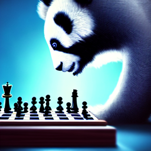
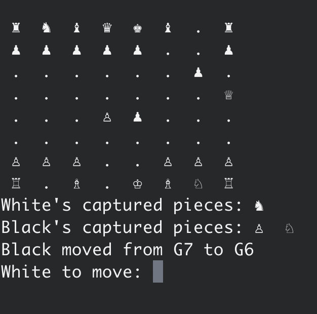
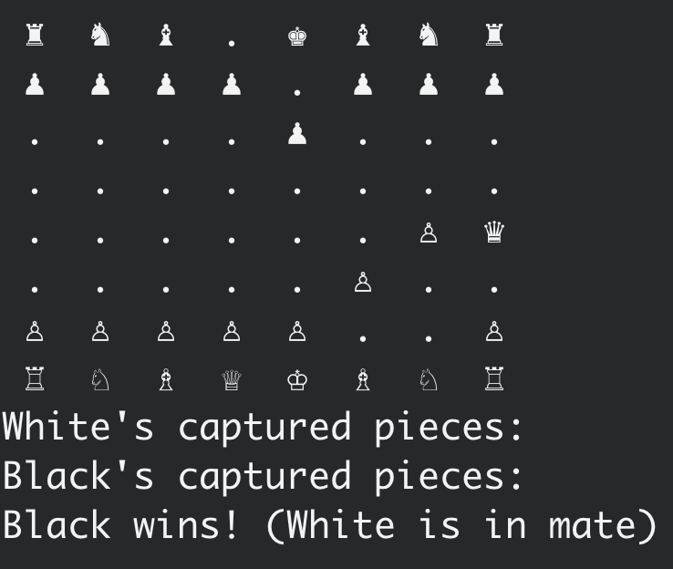

# blue-panda

A chess program and a CLI game written in Go with zero dependencies.  

  
(illustration by: [hotpot.ai](https://hotpot.ai/))


**Run CLI game** (in ./cli): ```go run .```  

screenshot of the CLI game:  

  

another screenshot (this time with a checkmate):  
  

**Run tests** (in root): ```go test ./...```  

Supports:  
* Human vs Human
* Human vs Computer
* Computer vs Computer
* 100 games of Computer vs Computer

Including:
* Threefold repetition  
* Fifty move rule
* Check detection
* Checkmate detection
* Stalemate detection
* Pawn promotion to Queen  
* Castling
* En passant  


The history of the latest game is saved in ./history


